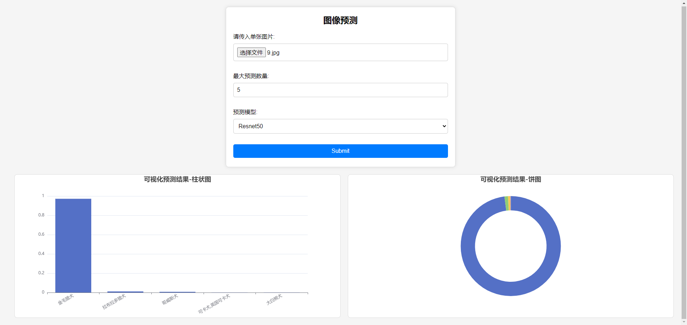
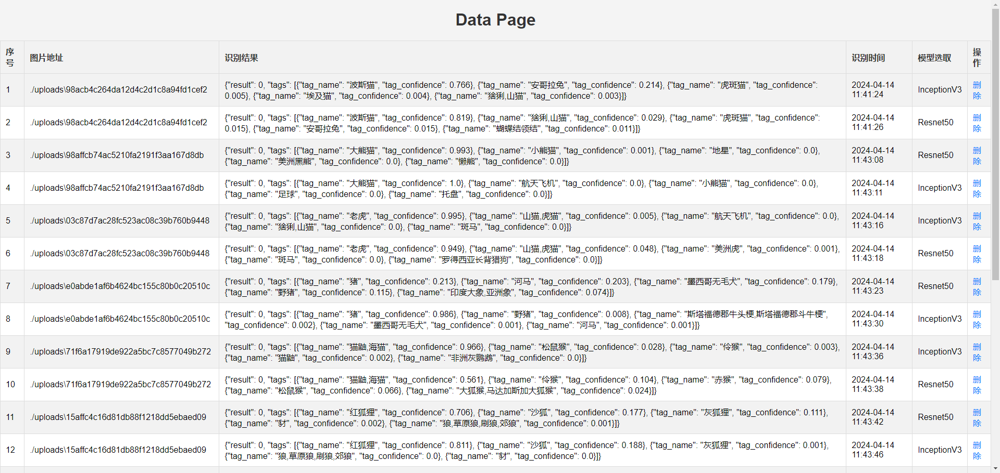

# Keras-ImageNet
基于Keras预训练模型ResNet50、InceptionV3，使用Python的HTTP框架Flask搭建图像识别接口，包含日志功能，可以进行可视化界面操作。


> * 页面展示  



> * 技术框架
```
Flask
Keras
Redis
Mysql
```

> * Request类型
```
file 图片 type(file)
top 分类的最大标签数量 type(integer)
network 分类模型选择 select(vgg/res/inc)
```

> * Response类型
```
{
  "result": 0, # 0 success 1 error
  "tags": [
    {
      "tag_confidence": 0.982,
      "tag_name": "老虎"
    },
    {
      "tag_confidence": 0.018,
      "tag_name": "山猫,虎猫"
    }
  ]
}
```

```
# For RestNet50 curl
curl "127.0.0.1:5000/api" -F"top=5" -F"net=res" -F"file=@tiger.jpg"
# For InceptionV3 curl
curl "127.0.0.1:5000/api" -F"top=5" -F"net=inc" -F"file=@tiger.jpg"
```
### 参考https://github.com/zhangbincheng1997/Keras-ImageNet
